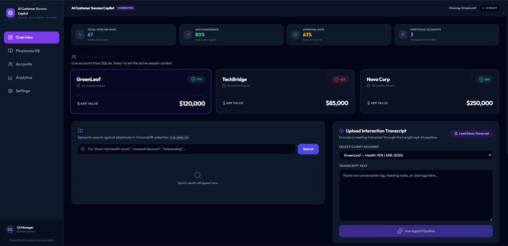
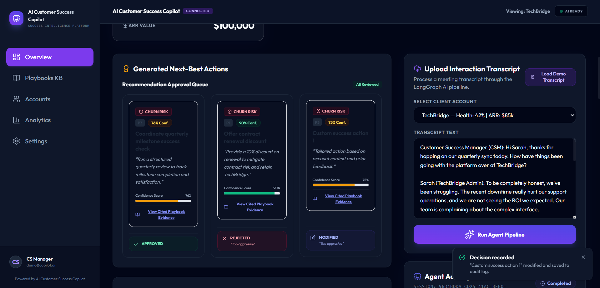
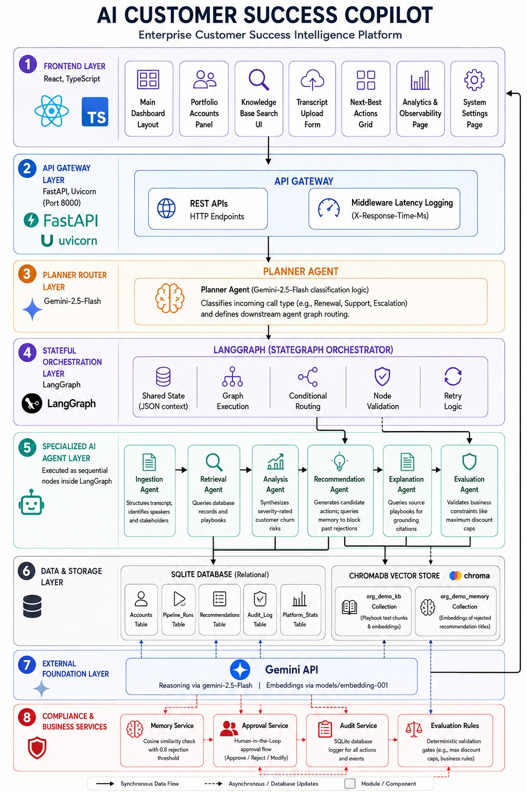
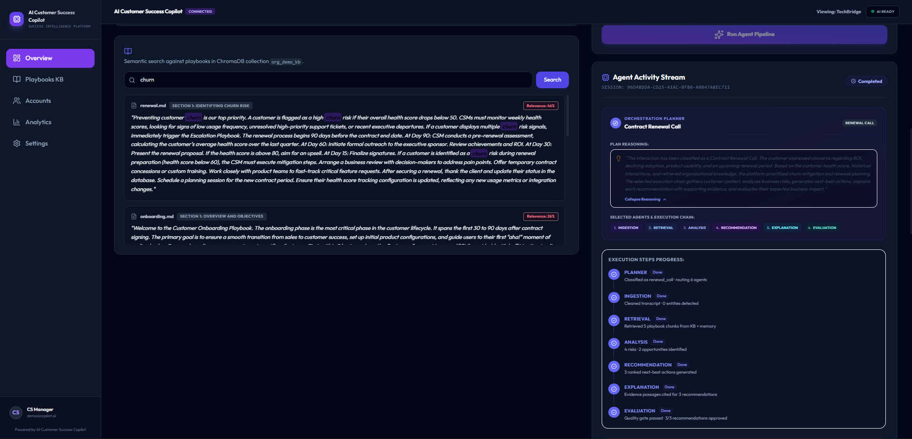
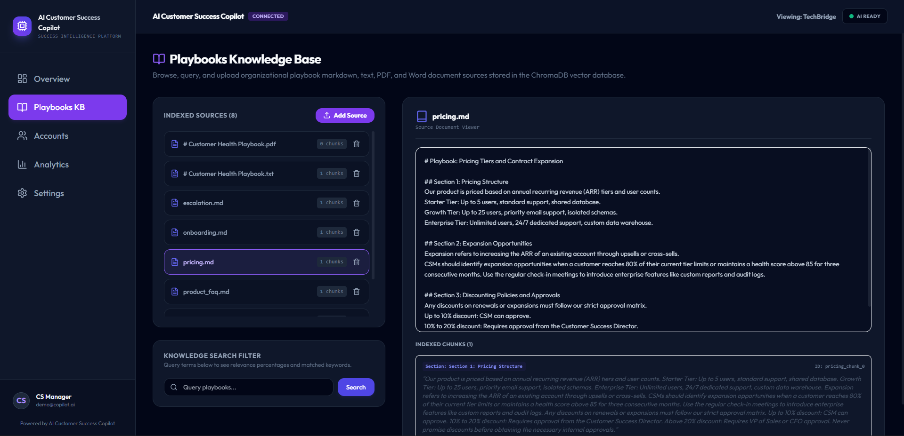
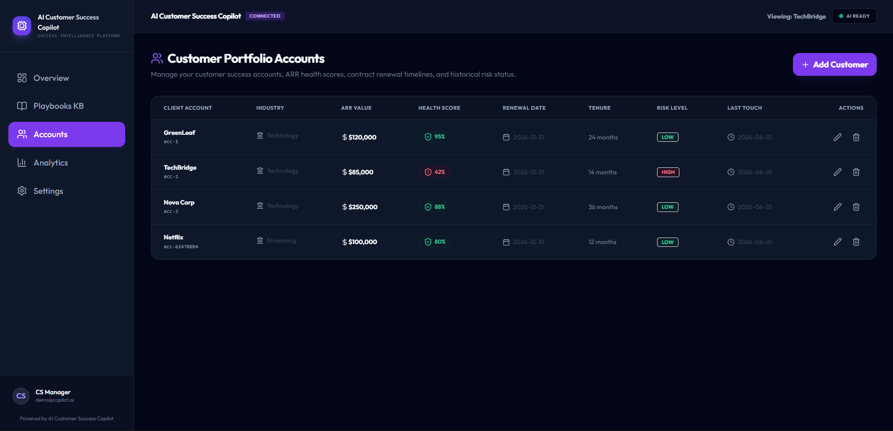
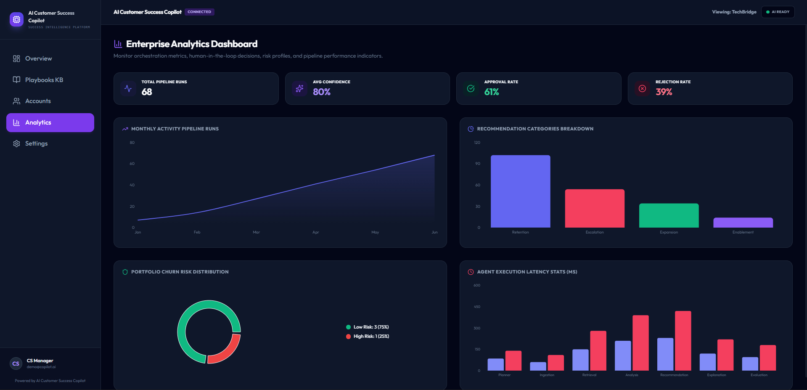

<div align="center">

# 🚀 AI Customer Success Copilot

### Enterprise Customer Success Intelligence Platform powered by Agentic AI

Transform customer conversations into **explainable, policy-compliant, and human-approved next-best actions** using a multi-agent AI architecture built with LangGraph, FastAPI, Gemini, ChromaDB, SQLite, and React.

---


</div>

---

# Dashboard Preview

<p align="center">

</p>

---

# Overview

AI Customer Success Copilot is an enterprise decision intelligence platform that assists Customer Success Managers in making faster, smarter, and more consistent business decisions.

Unlike traditional chatbots that simply answer questions, our platform combines **Agentic AI**, **Retrieval-Augmented Generation (RAG)**, **enterprise knowledge retrieval**, **persistent memory**, and **Human-in-the-Loop governance** to generate explainable next-best actions backed by organizational evidence.

The platform analyzes customer conversations, understands business context, retrieves relevant company playbooks, identifies risks and opportunities, recommends actions, explains every recommendation with supporting evidence, and continuously improves from previous human decisions.

---

# Key Features

### 🤖 Multi-Agent AI Architecture

Seven specialized AI agents collaboratively perform intelligent business reasoning.

- Planner Agent
- Ingestion Agent
- Retrieval Agent
- Analysis Agent
- Recommendation Agent
- Explanation Agent
- Evaluation Agent

---

### 📚 Enterprise Knowledge Retrieval

- Semantic search over company playbooks
- ChromaDB vector search
- Evidence-backed recommendations
- Retrieval-Augmented Generation (RAG)

---

### 🧠 Persistent AI Memory

Rejected recommendations are remembered using semantic embeddings, preventing similar recommendations from appearing in future analyses.

---

### 👨‍💼 Human-in-the-Loop

Every recommendation must be:

- ✅ Approved
- ✏️ Modified
- ❌ Rejected

before becoming organizational knowledge.

---

### 📊 Enterprise Dashboard

- Portfolio Management
- AI Pipeline Timeline
- Knowledge Base Search
- Analytics Dashboard
- Platform Statistics
- Audit Trail
- Customer Accounts

---

## AI Recommendation Engine

The copilot analyzes customer conversations, retrieves relevant organizational knowledge, evaluates business risks, and generates explainable next-best actions. Every recommendation includes confidence scores, supporting evidence, and a Human-in-the-Loop approval workflow.

<p align="center">

</p>

---

# 🏗️ System Architecture

Our platform follows a modular, layered architecture where specialized AI agents collaborate to transform customer conversations into explainable, evidence-backed recommendations.

<p align="center">

</p>

---

# 🔄 End-to-End Workflow

```text
Customer Transcript
        │
        ▼
 Planner Agent
 (Classifies Interaction)
        │
        ▼
 Ingestion Agent
 (Structures Transcript)
        │
        ▼
 Retrieval Agent
 (RAG + Customer Context)
        │
        ▼
 Analysis Agent
 (Risk & Opportunity Detection)
        │
        ▼
 Recommendation Agent
 (Next-Best Actions)
        │
        ▼
 Explanation Agent
 (Evidence & Citations)
        │
        ▼
 Evaluation Agent
 (Business Rule Validation)
        │
        ▼
 Human-in-the-Loop Review
        │
        ▼
 Audit Log + Memory
```

---

# 🤖 AI Agent Pipeline

Unlike traditional AI applications that rely on a single prompt, our platform distributes responsibilities across multiple specialized AI agents.

| Agent | Responsibility |
|--------|----------------|
| 🧭 Planner | Determines interaction type and execution path |
| 📥 Ingestion | Structures transcript and extracts key entities |
| 📚 Retrieval | Retrieves relevant playbooks and customer history |
| 🔍 Analysis | Detects churn risks and business opportunities |
| 💡 Recommendation | Generates ranked next-best actions |
| 📝 Explanation | Grounds every recommendation with evidence |
| ✅ Evaluation | Validates recommendations against business rules |

---

# ⚡ Agent Execution Timeline

The dashboard visualizes the execution of every AI agent in real time, allowing users to monitor the complete reasoning process instead of seeing only the final response.

<p align="center">

</p>

---

# 📖 Retrieval-Augmented Generation (RAG)

Enterprise playbooks are converted into semantic embeddings and stored in **ChromaDB**.

During execution, the Retrieval Agent performs semantic similarity search to fetch the most relevant organizational knowledge, ensuring every recommendation is grounded in company policies rather than relying solely on the language model.

### Knowledge Sources

- Customer Success Playbooks
- Renewal Guidelines
- Escalation Policies
- Pricing Policies
- Product Documentation
- Customer History

---

# 📚 Knowledge Base Search

Users can search organizational playbooks using natural language and instantly retrieve the most relevant sections through semantic search.

<p align="center">

</p>

---

# 🧠 Human-in-the-Loop + Memory

Every recommendation requires human review before becoming actionable.

Managers can:

- ✅ Approve
- ❌ Reject
- ✏️ Modify

Rejected recommendations are embedded and stored in **ChromaDB Memory**, allowing the Recommendation Agent to avoid suggesting semantically similar actions in future analyses.

This creates a continuously improving decision-making system while maintaining full transparency and governance.

---

# 📊 Platform Modules

AI Customer Success Copilot is designed as a complete enterprise platform with dedicated modules for Customer Success Managers, enabling seamless management of customer interactions, organizational knowledge, analytics, and AI-powered decision making.

---

# 🏠 Dashboard

The Dashboard serves as the central workspace where users can:

- Monitor portfolio health
- Upload customer interaction transcripts
- Run the AI pipeline
- Review recommendations
- View platform statistics
- Monitor AI agent execution
- Perform Human-in-the-Loop approvals

<p align="center">

</p>

---

# 👥 Customer Accounts

The Accounts module provides a centralized view of all customer accounts stored in SQLite.

### Features

- Portfolio overview
- Customer health score
- ARR tracking
- Renewal dates
- Risk levels
- Last interaction
- Customer history
- Add new customer accounts
- Edit existing accounts

<p align="center">

</p>

---

# 📚 Playbooks Knowledge Base

The Knowledge Base allows organizations to manage the documents that power the RAG pipeline.

Supported capabilities include:

- Upload Markdown playbooks
- Semantic search
- View indexed documents
- Inspect retrieved evidence
- Organize organizational knowledge

Every uploaded document is automatically chunked, embedded, and indexed into ChromaDB for semantic retrieval.

<p align="center">

</p>

---

# 📈 Analytics Dashboard

The Analytics module provides operational insights into the AI platform.

Available metrics include:

- Total Pipeline Runs
- Average Confidence Score
- Approval Rate
- Recommendation Distribution
- Customer Risk Distribution
- AI Performance Metrics
- Platform Health Statistics

These metrics are dynamically generated from SQLite and update as users interact with the platform.

<p align="center">

</p>

---

# ⚙️ System Settings

The Settings page provides operational visibility into the platform without exposing sensitive credentials.

Displayed information includes:

- AI Model Status
- Database Connectivity
- ChromaDB Status
- SQLite Status
- Platform Version
- Theme Preferences
- Environment Information

This follows enterprise best practices by displaying system health rather than exposing API keys or confidential configuration.

---

# 🛠 Technology Stack

| Category | Technologies |
|-----------|--------------|
| **Frontend** | React, TypeScript, Vite, Tailwind CSS |
| **Backend** | FastAPI, Python |
| **AI Orchestration** | LangGraph |
| **LLM** | Gemini 2.5 Flash |
| **Vector Database** | ChromaDB |
| **Relational Database** | SQLite |
| **Knowledge Retrieval** | Retrieval-Augmented Generation (RAG) |
| **Memory** | Semantic Vector Memory |
| **APIs** | REST APIs |
| **Deployment Ready** | Modular Enterprise Architecture |

---
