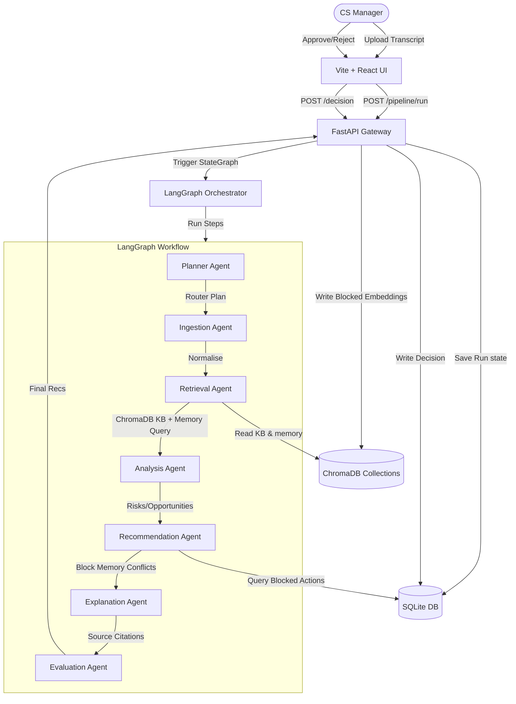

# System Architecture walkthrough

This document provides a comprehensive technical walkthrough of the Customer Success Copilot Copilot system architecture.

---

## 1. High-Level Data Flow

---

## 2. Component Blueprint

### A. Graph Orchestrator (`backend/graph/build_graph.py`)
Built on LangGraph's `StateGraph`. The pipeline runs a stateless schema of keys (`raw_text`, `planner_decision`, `analysis`, `recommendations`, `retrieved_chunks`, `status`, `errors`) that gets updated step-by-step.
- **Node Execution**: Sequential execution starting from the Planner classification down to Evaluation rules.
- **State Management**: Each node receives the current state, executes its LLM call/mock reasoning, and returns the incremental state delta.

### B. Core Agents (`backend/agents/`)
1. **Planner Agent**: Classifies the interaction type (e.g. `QBR`, `RENEWAL`, `SUPPORT_ESCALATION`, `SALES_CALL`) and plans the sequence.
2. **Ingestion Agent**: Formats the transcript, extracts speaker turns, and identifies stakeholders.
3. **Retrieval Agent**: Queries the vector database collection `org_demo_kb` for relevant success playbooks. It also fetches previous decisions from memory.
4. **Analysis Agent**: Synthesizes customer risks (rated by severity), opportunities, and missing info.
5. **Recommendation Agent**: Formulates 3 ranked recommendations. It blocks any recommendation whose similarity with previously rejected recommendations in `org_demo_memory` is higher than `0.8` using cosine distance.
6. **Explanation Agent**: Performs citation searches to highlight exact quoted texts from source documents for each action.
7. **Evaluation Agent**: Runs rule checks (e.g., maximum discount threshold caps).

### C. Database Architecture
1. **SQLite (`backend/db/sqlite.py`)**:
   - **`accounts`**: Table containing static customer accounts (ARR, tenure, health score).
   - **`pipeline_runs`**: Persists the session status, execution history, and state JSON.
   - **`recommendations`**: Stores all generated recommendations, priority, confidence, and validation status.
   - **`audit_log`**: Table containing all human-in-the-loop decisions (approved, rejected, modified) with timestamp, note, and the user.
2. **ChromaDB (`backend/db/chroma.py`)**:
   - **`org_demo_kb`**: Stores playbook documentation chunks.
   - **`org_demo_memory`**: Stores embeddings of rejected recommendation titles to facilitate semantic conflict-avoidance.

### D. Memory Service & Conflict Avoidance (`backend/services/memory_service.py`)
- When a recommendation is rejected in the UI, it sends a request to the backend.
- The backend writes the rejection synchronously to the SQLite `audit_log` (source of truth) and asynchronously writes the embedding to ChromaDB's `org_demo_memory` collection (best-effort).
- On subsequent runs, the **Recommendation Agent** retrieves rejected action texts, checks candidates against them using vector similarity, and blocks/replaces any candidate matching with a score > `0.8`.

---

## 3. Platform Observability & Logging

### A. Response-Time Logging Middleware
A FastAPI custom middleware intercepts all requests, measures elapsed wall time, logs request metadata, and appends the latency value in the response header as `X-Response-Time-Ms`.
This is invaluable for tracking the p95 latency profile of agent invocations.

### B. Health & Platform Stats
The `/api/v1/platform/stats` endpoint runs aggregated SQL queries to supply metrics to the frontend's Platform Health Panel:
- **Total runs count**
- **Average recommendation confidence**
- **Decision approval rate percentage**
